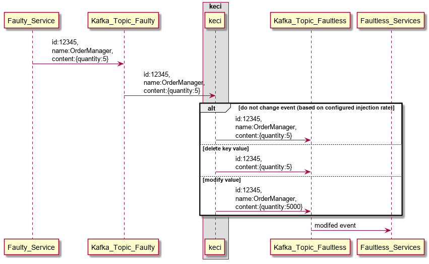

# kafka-event-chaos-injection
Inject exceptions to events to test the resilience of consumers

# Motivation
Test the resilience of the system against faulty events. 
The events should be part of a process to be able to test how features like exception handling and housekeeping behave.

# Idea:
Use the man in the middle attack pattern to modify Kafka events and let the modified events consume by the software under test.
Thus, the resilience of the software and of overall solutions should be tested.

Possible modifications:
* delete key value
* change datatype of value
* change value semantically (for example datetime to 01.01.1900)
* replace specific value (for example location 'Berlin' gets replaced by 'Hamburg')
* duplicate event
* etc

# Overview



## Getting Started

To run the software navigate to the folder and run command  
```
python index.py
### Build docker image
docker build -t keci .

### Start interactive with command
docker run -i -t  keci /bin/bash
python src/app.py

### Start interactive 
docker run -i -t  keci
```

### Prerequisites

Required modules:
```
pip -install -r requirements.txt
```

### Coding style

pep8 remarks taken into account as well as pylint.

